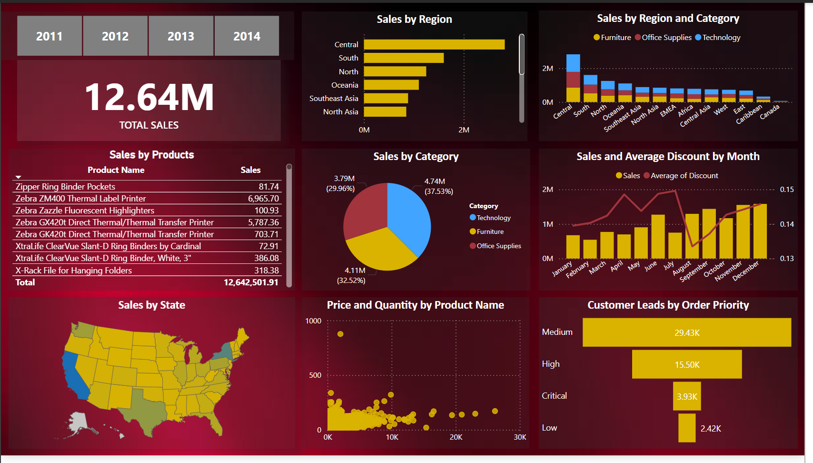

# 📊 Sales Performance Analysis Dashboard (Power BI)

## Overview
This project presents a comprehensive **Sales Performance Dashboard** developed in **Power BI**, designed to provide strategic insights from a sales dataset totaling over **$12.64 million** in revenue. The dashboard analyzes multi-year sales data across various dimensions including geography, product category, customer priority, and time.

## 📈 Key Business Questions Answered
- Which regions and states are generating the highest revenue?
- What are the top-performing product categories and individual products?
- How do monthly sales trends align with discounting strategies?
- What is the distribution of customer leads based on order priority?
- Where are there opportunities for sales growth and process optimization?

## 🧰 Tools & Technologies
- **Power BI Desktop**
- **DAX (Data Analysis Expressions)**
- **Power Query for Data Cleaning & Transformation**
- **Excel (Data Source)**

## 📊 POWER BI Dashboard 

# FEATURES
- **Sales by Region & State**
- **Sales by Product and Product Category**
- **Monthly Sales with Average Discount Trends**
- **Price vs Quantity Bubble Chart**
- **Customer Priority Funnel Analysis**
- **Dynamic Filtering & Cross-Filtering Interactions**

_You can access and interact with the Power BI dashboard_ [here](https://github.com/ToriAtas/Sales-analysis/blob/main/Sales_Performance_Dashboard.pbix)

## 💡 Insights Uncovered
- **Technology** category leads with 37.53% of total sales.
- **Central region** dominates sales contribution across all product categories.
- Sales peak in **Q4**, especially in **December**, hinting at year-end procurement surges.
- Most customer leads fall under **Medium and High priority**, suggesting a focus on mid-urgency B2B clients.
- High-volume, low-price items dominate, with few outliers in the premium product segment.

## Conclusions

The dashboard reveals a strong business performance foundation with clear opportunities for growth through targeted regional expansion, product optimization, and customer segmentation. Continued data-driven strategy will enable better forecasting, inventory planning, and campaign effectiveness in the competitive landscape.

## Recommendations

Based on the sales performance analysis, several strategic recommendations are proposed to enhance business outcomes. The Central region, having consistently outperformed others, should receive deeper investment in terms of sales operations and marketing to solidify its market dominance. Meanwhile, underperforming regions such as Africa, the West, and the Caribbean present untapped potential and should be explored through localized market research, targeted promotions, and potential partnerships. The product portfolio shows that technology items, particularly Zebra printers, are top performers and should be prioritized, while low-selling products may require reevaluation or repositioning. Seasonal spikes in Q4 suggest a strong case for increasing inventory and promotional activities ahead of October through December. However, inconsistencies between discount levels and sales volume indicate a need for more data-driven discount strategies to preserve profit margins. Although medium-priority customer leads dominate, critical and high-priority leads—despite being fewer—should be given special attention, possibly through dedicated sales reps or account management. The low-volume sales of high-priced products suggest an opportunity for bundling or strategic upselling. Additionally, states with low sales activity should be targeted for geographic expansion through outreach and regional sales efforts. Finally, a close eye should be kept on the price-to-quantity ratio to support demand forecasting, and customer feedback should be integrated into future analyses to ensure product strategies align with user expectations. Collectively, these recommendations aim to drive sales growth, operational efficiency, and market expansion. 

*By implementing these recommendations, the organization can optimize revenue, enhance customer satisfaction, and improve workforce efficiency, ensuring sustained growth and profitability.* 🙂

## 📂 Folder Structure

- Dashboard.png #Screenshot of the Power BI Dashboard
- Sales_Performance_Report.docx #Detailed written report with insights
- README.md #Project documentation

## 🚀 How to Use
1. Download the `.pbix` file (Power BI file) from the repository.
2. Open with Power BI Desktop.
3. Connect to the provided Excel data source (if shared).
4. Explore the dashboard visuals and adjust filters as needed.

## 📝 Report Summary
A detailed written report is included in this repo (`Sales_Performance_Report.docx`), summarizing all analytical findings and strategic recommendations for business optimization.

---
[Sales_Performance_Report.pdf](https://github.com/ToriAtas/Sales-analysis/blob/main/Sales_Performance_Report.pdf)

## 📌 Note
If you find this project insightful, feel free to star ⭐ the repo or connect with me for freelance collaborations or dashboard development projects.

